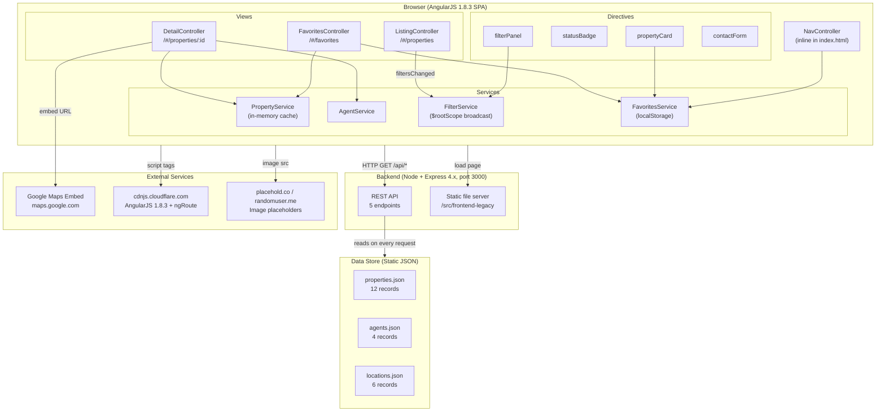

# QueenFiona Real Estate — Property Listings Portal

**Team:** QueenFiona

| Name |
|------|
| Krzysztof Dajnowicz |
| Tomasz Filak |
| Marcin Grudzinski |
| Beata Jaros |
| Jakub Kaczmarek |
| Wojciech Kaczmarek |
| Lukasz Kuklis |

---

**Client:** QueenFiona Real Estate  
**System:** Property Listings Portal  
**Original build:** 2016, AngularJS 1.x  
**Migration target:** Angular 17+ (standalone components, signals API)

---

## Business Context

QueenFiona's property listings portal was built in 2016 by a vendor who is no longer engaged. AngularJS reached end-of-life in December 2021, and the system has received no security patches since. The codebase has no tests, no documentation, and tribal knowledge left with the previous team.

Every feature request requires weeks of investigation before any code is written due to hidden dependencies and side effects. The product roadmap has been frozen for 18 months as a result.

**Planned features blocked by the current state:** property alerts, agent dashboards, mobile experience.

**The mandate:** assess the current system, establish a safe base for change, and extract core capabilities into a maintainable architecture — without taking the portal offline.

---

## System Architecture Overview

The legacy system is a three-tier architecture: a single-page AngularJS application served by a minimal Node/Express backend that reads static JSON files as its data store. There is no database, no authentication, and no server-side search — all filtering and sorting logic runs in the browser.

### Tiers

| Tier | Technology | Role |
|------|-----------|------|
| Frontend SPA | AngularJS 1.8.3, plain CSS, CDN-loaded scripts | UI rendering, client-side filtering, routing |
| Backend API | Node.js + Express 4.x | Serves static frontend + thin REST API over JSON files |
| Data store | Static JSON files (`/legacy/data/`) | Properties (12), agents (4), locations (6) |

### API Endpoints

| Method | Path | Purpose |
|--------|------|---------|
| `GET` | `/api/properties` | List all properties (optional query params: type, status, location, bedroomsMin, priceMin, priceMax) |
| `GET` | `/api/properties/:id` | Single property detail |
| `GET` | `/api/agents` | List all agents |
| `GET` | `/api/agents/:id` | Single agent detail |
| `GET` | `/api/locations` | List all locations for filter dropdown |
| `GET` | `*` | SPA catch-all → `index.html` |

### Frontend Modules

The SPA is decomposed into services (shared state), directives (reusable UI), and controllers (view logic), wired together via `ngRoute` hash-based routing (`/#/properties`).

**Services (factories)**

| Service | Responsibility |
|---------|---------------|
| `PropertyService` | Fetches properties with in-memory cache |
| `AgentService` | Fetches agents (no cache) |
| `FilterService` | Holds filter state; applies & sorts in memory; broadcasts `filtersChanged` via `$rootScope` |
| `FavoritesService` | Reads/writes favorite property IDs to `localStorage` |

**Directives (components)**

| Directive | Inputs | Purpose |
|-----------|--------|---------|
| `propertyCard` | `property =` | Listing card with favorite toggle |
| `statusBadge` | `status @` | Color-coded status chip |
| `filterPanel` | (none — reads FilterService directly) | Filter sidebar |
| `contactForm` | `agent =` | Contact form (client-side only — logs to console, no delivery) |

**Controllers / Views**

| Route | Controller | View |
|-------|-----------|------|
| `/#/properties` | `ListingController` | Grid of property cards + filter panel |
| `/#/properties/:id` | `DetailController` | Full property detail + Google Maps embed + agent card |
| `/#/favorites` | `FavoritesController` | Filtered grid of saved properties |

---

## Architecture Diagram



---

## Technical Debt

### Critical (security / compliance risk)

| Issue | Detail |
|-------|--------|
| **EOL framework** | AngularJS 1.x reached end-of-life December 2021. No security patches available. Any discovered XSS or prototype-pollution vulnerability in AngularJS itself cannot be patched. |
| **No authentication** | The portal and its entire data API are publicly accessible with no auth layer. Anyone can enumerate all properties and agent contact details. |
| **Contact form has no backend** | `contactForm` directive submits to `console.log()`. No email is ever sent. Agents are not notified of inquiries. This is a silent functional regression. |
| **No HTTPS enforcement** | Server binds to plain HTTP on port 3000. No TLS configuration present. |

### High (maintainability / velocity blockers)

| Issue | Detail |
|-------|--------|
| **No tests** | Zero unit, integration, or e2e tests. Every change carries unknown regression risk — confirmed by two past incidents where unrelated features broke. |
| **No build toolchain** | Scripts are loaded via `<script>` tags in dependency order in `index.html`. No bundling, tree-shaking, minification, or cache-busting. Adding a dependency means editing HTML manually. |
| **`$rootScope.$broadcast` for state** | `FilterService` broadcasts `filtersChanged` on `$rootScope`. Any controller in the tree can silently intercept or shadow this event. Debugging requires knowing the full event propagation path. |
| **Two-way `=` bindings on directives** | `propertyCard` and `contactForm` use two-way scope binding (`=`). Mutations inside directives silently update parent scope, making data flow non-deterministic. |
| **In-memory cache with no invalidation** | `PropertyService` caches the full property list after the first fetch and offers only a manual `clearCache()`. Stale data is served indefinitely after any data change. |
| **Client-side-only filtering** | All 12 properties are fetched on every page load and filtered in the browser. This will not scale and bypasses any future server-side access control. |
| **No error handling** | HTTP failures in all services are silent — no `.catch()` blocks, no user-facing error states, no retry logic. |

### Medium (code quality)

| Issue | Detail |
|-------|--------|
| **Fake promise pattern** | `PropertyService.getAll()` returns a real `$http` promise on the first call but a `$q.resolve()` fake on cache hits. Callers cannot distinguish the two, and the pattern breaks if `$q` is not injected. |
| **Manual array operations in FavoritesService** | Uses `indexOf` and `splice` instead of `Array.find` / `Array.filter`. Written before ES6 but never updated. |
| **Deeply nested conditionals in FilterService** | `apply()` is 80+ lines of nested `if` blocks. Adding a new filter field requires understanding the full evaluation tree. |
| **Backend reads files on every request** | `server.js` calls `JSON.parse(fs.readFileSync(...))` inside each route handler. No caching, no connection pooling. Acceptable for 12 records; unacceptable at scale. |
| **Inline NavController** | The nav bar controller is defined as an anonymous function directly in `index.html`. It cannot be unit-tested, found by search, or reused. |

---

## Running the Application

Requirements: Node.js 14+

```bash
# Install backend dependencies
cd src/backend
npm install

# Start the server (serves both API and frontend)
npm start
# or for auto-reload during development:
npm run dev
```

Open [http://localhost:3000](http://localhost:3000) — the app redirects to `/#/properties`.

Alternatively, run the provided `run.bat` script from the project root on Windows.

---

## Migration Plan

The codebase is being migrated to **Angular 17+** with standalone components and the signals API. Migration follows the skill-guided sequence defined in [CLAUDE.md](CLAUDE.md):

1. Pre-migration analysis
2. Leaf services (`PropertyService`, `AgentService`, `FavoritesService`, `FilterService`)
3. Filters / pipes (`statusBadge`)
4. Leaf components → container components
5. Routing
6. Module bootstrap
7. Tests throughout

Architecture decisions are documented in [docs/adr/](docs/adr/). Coding conventions for the target Angular app are in [docs/conventions.md](docs/conventions.md).
